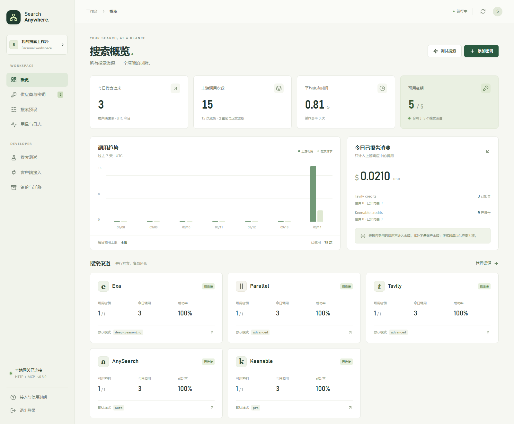

# Search Anywhere

**面向 AI 应用与 Agent 的多供应商搜索网关。**

[](https://github.com/sdxdlgz/search-anywhere/actions/workflows/image.yml)
[](https://github.com/users/sdxdlgz/packages/container/package/search-anywhere)

[快速开始](#快速开始) · [客户端接入](docs/clients.md) · [部署指南](docs/deployment.md) · [使用指南](docs/usage.md) · [开发与贡献](#开发与贡献)

Search Anywhere 将 **Exa、Parallel、Tavily、AnySearch 和 Keenable** 聚合到统一的 HTTP API 与 MCP 服务中。一次请求可并行检索多个供应商，合并重复 URL，并保留各来源的摘录、正文与调用记录。

适用于需要多来源检索的 AI 助手、编码 Agent 和研究工作流。搜索渠道、API key、预设和用量在一个控制台管理，客户端只需连接网关。



*控制台预览，使用模拟数据；图中数字不代表性能测试或供应商实际额度。*

## 核心功能

- **多供应商检索** — 按预设选择参与渠道与搜索模式，支持域名过滤、超时和缓存设置。
- **多 key 管理** — 同一供应商内轮询、并发控制与失败隔离；支持批量添加、来源备注和脱敏展示。
- **可追溯的结果** — 按 URL 去重并保留逐来源证据，支持结果分页、摘录分页和正文读取。
- **用量与余额** — 分别记录上游调用、已报告费用和估算费用；支持单 key、批量额度查询及 Exa 手动余额校准。
- **客户端统计** — 每个搜索访问凭证独立显示累计与本月请求、上游调用和消耗，历史清理后仍保留统计。
- **统一工具接口** — 通过 Streamable HTTP MCP 或 HTTP API 接入具备工具调用能力的客户端。
- **自托管与迁移** — Docker 双架构镜像、SQLite 持久化、凭证加密存储，以及带预览和事务恢复的加密备份。

普通 Parallel 检索支持免费 MCP 优先，明确限流后回退至付费 API；高级模式直接调用 API。具体路由和供应商能力见[使用指南](docs/usage.md)。

## 快速开始

需要 Docker Engine 和 Docker Compose 插件。建议至少 2 GiB 内存。

```bash
mkdir -p search-anywhere
cd search-anywhere
curl -fsSLO https://raw.githubusercontent.com/sdxdlgz/search-anywhere/main/compose.yaml
docker compose up -d
docker compose exec search-anywhere npm run admin:token
```

打开 <http://localhost:8765>，使用最后一条命令显示的管理员口令登录。

1. 在 **供应商与密钥** 添加搜索供应商的 API key。
2. 在 **搜索预设** 选择参与渠道和模式，新安装默认使用“覆盖优先”。
3. 在 **搜索测试** 执行查询，查看来源、摘录和调用状态。
4. 在 **客户端接入** 为应用创建搜索访问凭证，并配置 MCP 或 HTTP API。

默认端口只绑定部署主机的 `127.0.0.1`，数据保存在 Docker 命名卷中。远程服务器访问、HTTPS、环境变量和更新方法见[部署指南](docs/deployment.md)。镜像支持 `linux/amd64` 与 `linux/arm64`，可匿名拉取。

## 接入应用

管理员口令用于管理控制台；**搜索访问凭证**用于下面的工具接口。模型推理服务可独立配置，网关无需绑定特定模型供应商。

### MCP

在客户端中添加 Streamable HTTP 服务。以下为通用 JSON 配置示例：

```json
{
  "mcpServers": {
    "search-anywhere": {
      "type": "http",
      "url": "http://localhost:8765/mcp",
      "headers": {
        "Authorization": "Bearer YOUR_SEARCH_TOKEN"
      }
    }
  }
}
```

将地址替换为客户端可访问的网关地址，工具调用超时建议至少 180 秒。[客户端接入指南](docs/clients.md)提供 Claude Code、Codex、Hermes、LobeChat、Kelivo 和 DSH 的配置方式，以及 Pi 扩展接入说明。

| MCP 工具 | 功能 |
| --- | --- |
| `search` | 检索并创建结果集合 |
| `search_results` | 分页读取已保存的结果 |
| `get_evidence` | 读取某个 URL 的逐来源摘录与正文片段 |
| `fetch` | 请求网页正文并保存结果 |

### HTTP API

将搜索访问凭证设置为环境变量 `SEARCH_ANYWHERE_TOKEN` 后调用：

```bash
curl http://localhost:8765/v1/search \
  -H "Authorization: Bearer $SEARCH_ANYWHERE_TOKEN" \
  -H "Content-Type: application/json" \
  -d '{"query":"SQLite WAL 模式如何处理并发读写？","profile":"coverage","max_results":10}'
```

`max_results` 控制本次响应的展示条数。其余结果保存在返回的 `collection_id` 中，可继续分页读取。[HTTP API 与分页说明](docs/clients.md#http-api)

## 文档

| 文档 | 内容 |
| --- | --- |
| [部署与配置](docs/deployment.md) | Docker、源码运行、反向代理、环境变量、更新与回退 |
| [使用指南](docs/usage.md) | 供应商、搜索预设、key 管理、用量与余额 |
| [客户端接入](docs/clients.md) | MCP 配置、HTTP API、分页与连接排查 |
| [备份与迁移](docs/backup-migration.md) | 导出、导入、跨主机迁移及备份格式 |
| [历史数据清理](docs/history-retention.md) | 自动保留期限、手动清理、计费记录与空间复用 |
| [研究工作流](docs/research-workflow.md) | 多轮检索、证据读取、交叉核对与验收 |
| [上游查询提示](docs/search-warnings.md) | 数量限制、截断和供应商警告的处理 |

## 运行边界

搜索结果受上游覆盖范围、模式、数量和超时限制。网关负责检索与证据保存；问题拆解、多轮补搜和事实核对由调用方完成。多个供应商命中同一网页不代表多个独立来源。

当前采用单进程 SQLite，适合单实例部署；不支持多个实例共用数据目录。**默认开启自动清理，保留最近 7 天的搜索历史内容**，可在“备份与迁移 → 历史数据清理”修改或关闭。精简计费记录持续保留，累计用量和手动余额不受清理影响。[清理范围与空间说明](docs/history-retention.md)

备份恢复会替换目标业务数据，操作前请阅读[迁移指南](docs/backup-migration.md)。

**迁移后请检查 Parallel 的余额查询授权。** 如果显示授权失效，需要在目标实例重新通过 Parallel 官网授权。该授权用于查询余额，失效不代表搜索 API key 失效。

## 开发与贡献

需要 Node.js 24 或以上。

```bash
git clone https://github.com/sdxdlgz/search-anywhere.git
cd search-anywhere
npm ci
npm run dev
```

提交前运行 `npm test` 和 `npm run build`。后端协议测试使用模拟上游；浏览器和容器检查方法见[开发验证](docs/deployment.md#开发验证)。

欢迎通过 [Issues](https://github.com/sdxdlgz/search-anywhere/issues) 报告问题，或提交 Pull Request 改进供应商适配、客户端兼容和文档。问题报告请包含版本、部署方式、复现步骤及脱敏日志；PR 请说明行为变化和验证结果。不要提交 API key、登录凭证、`.env`、数据库或备份文件。
